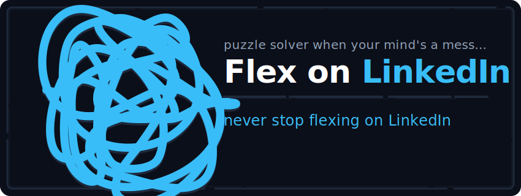

<p align="center">
  
</p>

<p align="center">
  <a href="https://github.com/fishOmlette/FlexonLinkedIn/actions"></a>
  <a href="https://github.com/fishOmlette/FlexonLinkedIn/releases"></a>
  <a href="https://github.com/fishOmlette/FlexonLinkedIn/blob/main/LICENSE"></a>
  <a href="https://github.com/fishOmlette/FlexonLinkedIn/pulls"></a>
</p>

---

### Companion for LinkedIn daily games (Queens, Sudoku, Zip, Patches, Tango) — puzzle solver when your mind's a mess.

<p align="center">
  
</p>

## 🎮 Supported Games
* 👑 **Queens** (Backtracking Solver)
* 🔢 **Mini Sudoku** (Backtracking Grid Solver)
* ⚡ **Zip** (Wall-Aware Hamiltonian Path Finder)
* 🧩 **Patches** (Backtracking Shape Packer)
* ☀️ **Tango** (Balanced Sun/Moon Constraint Solver)

## 🚀 Getting Started
1. **Clone this repository**:
   ```bash
   git clone https://github.com/fishOmlette/FlexonLinkedIn.git
   ```
2. Go to `chrome://extensions/` in Google Chrome, enable **Developer mode**, and click **Load unpacked**.
3. Select this folder to install the extension.
4. Navigate to [LinkedIn Games](https://www.linkedin.com/games/), open a game, and click the floating **✨ Solve** button in the bottom right corner!

---

## 📝 Disclaimer
This extension is created strictly for educational and entertainment purposes. Use it responsibly and enjoy flexing! 🚀
