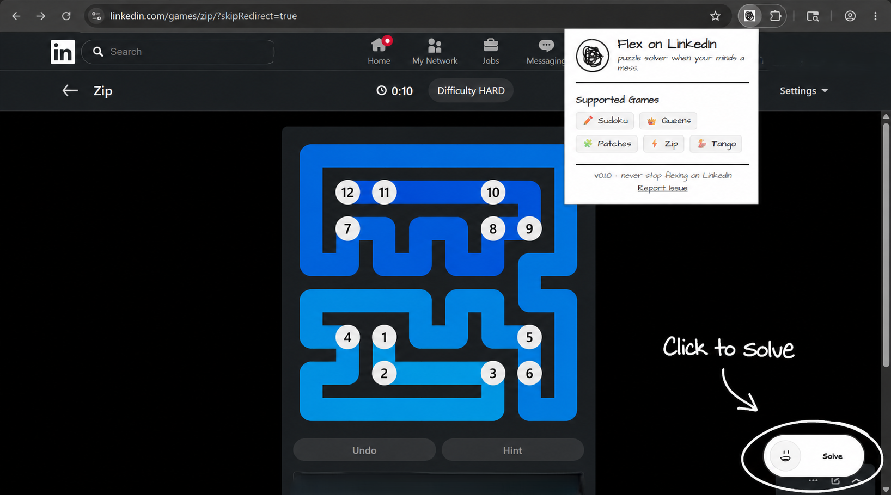

# Flex on LinkedIn 🚀

<p align="left">
  
  
</p>

---

### Companion for LinkedIn daily games (✏️Sudoku, 👑Queens, 🧩Patches, ⚡Zip, 💃Tango).

<p align="center">
  
</p>

## 🎮 Supported Games
* 👑 **Queens** (Backtracking Solver)
* ✏️ **Mini Sudoku** (Backtracking Grid Solver)
* ⚡ **Zip** (Wall-Aware Hamiltonian Path Finder)
* 🧩 **Patches** (Backtracking Shape Packer)
* 💃 **Tango** (Balanced Sun/Moon Constraint Solver)

## 🚀 Getting Started
1. **Clone this repository**:
   ```bash
   git clone https://github.com/fishOmlette/FlexonLinkedIn.git
   ```
2. Go to `chrome://extensions/` in Google Chrome, enable **Developer mode**, and click **Load unpacked**.
3. Select this folder to install the extension.
4. Navigate to [LinkedIn Games](https://www.linkedin.com/games/), open a game, and click the floating **✨ Solve** button in the bottom right corner!

---

## 📝 Disclaimer
This extension is created strictly for educational and entertainment purposes. Use it responsibly and enjoy flexing! 🚀
